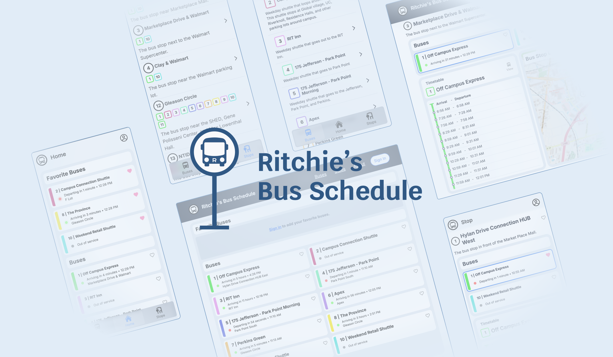
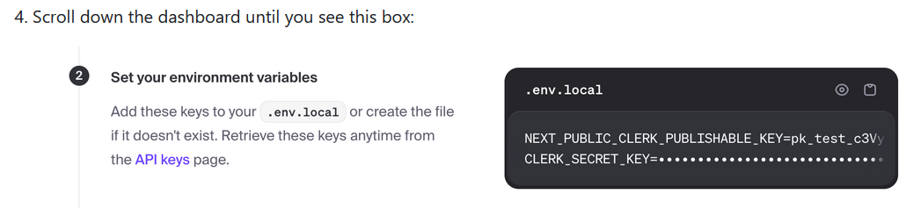
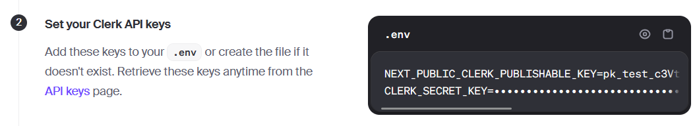
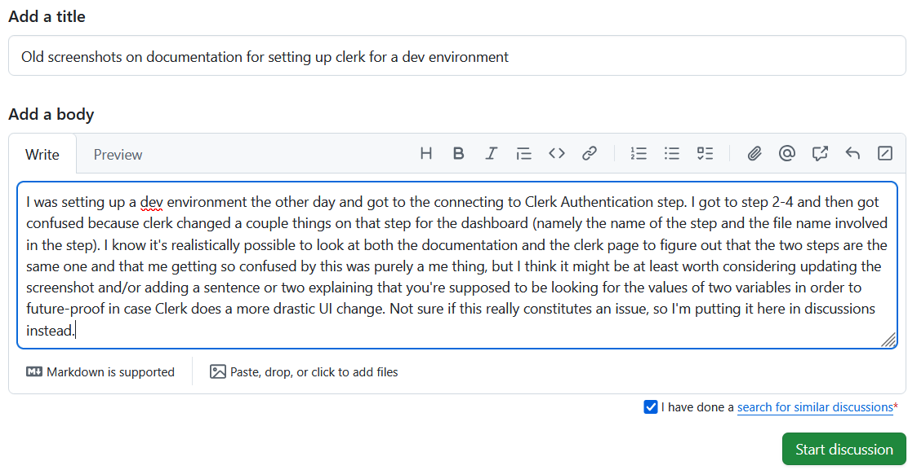
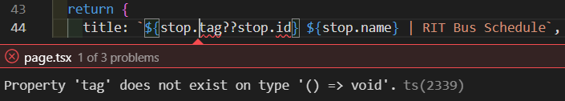

## What I picked and why
Now that I'm actually doing work, I managed to contribute to a project. For my project, I chose to work on [Ritchie's Bus Schedule](https://github.com/hiromon0125/ritchie-bus-schedule). As I live on-campus and don't have a car, I have to use the campus shuttles to go grocery shopping, and this project compiles the bus schedules in an easy-to-process format, so I do have a vested interest in this project working as well as it can. Plus, the onboarding process is pretty lenient: In order to contribute, you just create a fork and make a pull request when you're done working on a patch or feature. Even when I was doing that half-hearted attempt at a search a few weeks ago, I still greatly considered this project due to the onboarding process.

## Getting involved
Because of there being no onboarding process, I could immediately get to work on setting up the developer environment. I'd never worked with pretty much anything the project uses, but setting up the developer environment wasn't even that hard. The instructions provided are easy to understand and basically only require understanding what the command line is which, considering this is on GitHub, is not that uncommon. I would like to emphasize that the instructions are good, because I now need to say that my brain decided to essentially stop working in a way that made me restart the process from scratch most of the way through twice and it is entirely my fault. A large portion of the guide is signing up for and linking your clone of the repository to external services (namely Supabase, Clerk Authentication System, and Redis Cache). One of the steps for Clerk tells you to look for this:

That's fine and all, there's nothing to misinterpret, but I was just being stupid when I was setting it up, because since that screenshot was taken, Clerk made some extremely minor tweaks to the page. That step you're supposed to look for on Clerk now looks like this:

It's really nothing, but I guess I got way too fixated on the title and filename and ended up trying to run the prior step on the Clerk page (which did not need to be done since the repository already went through this process). When I figured it out, I thought that I probably wasn't the dumbest person on the planet and decided to bring up in the discussions:

The project maintainer did respond in good time, but I was busy at that point and by the time I noticed, they and Adrian had continued discussion on the topic and I had nothing to add (I know you'll probably see this, Adrian, so thanks!). I guess this counts as communication with the project maintainer, but I basically just said something and left, so I'm not going to focus on it.

After that, I still had some troubles getting the database to work since Redis wouldn't get its tables updated (I needed them to since my input for the tables wasn't enough to test pages) and I thought it was a flaw with Supabase, so I went a little crazy there until I decided to reset the Redis database. After that, though, I had no more problems with the developer environment, and I was ready to contribute.

## The "Issue"
It took me a while to pick an issue. Either I wasn't confident in my ability to perform the fix or I had no idea how to add documentation. I eventually landed on [a set of related issues regarding adding metadata to pages](https://github.com/hiromon0125/ritchie-bus-schedule/issues/102), and I'm glad I did (I'll get back to that later). It's not a bug fix (though one of the child issues was labeled as such), but it involved adding metadata constants and generateMetadata functions to some tsx files throughout the app. I wasn't too big of an issue, as it was mostly just adding an import and an export to each file. However, while I had worked with TypeScript before, it was in combination with HTML and CSS (and also used Angular in the TS files, but I'd rather not use that again) and I had never added metadata before. Fortunately, this was in fact marked as a good first issue and the description also provided a link to a reference for the metadata functions. The only real difficulty I had was [the issue regarding the page(s) for each individual stop](https://github.com/hiromon0125/ritchie-bus-schedule/issues/104), as stop is also a function in TypeScript, so trying to get the value of, say, stop.name would be...

...difficult. That issue thankfully had an example of a correct implementation of the requested solution in another file, so I could look at that and figure out what was going wrong (I didn't correctly convert everything I needed to). After that, it was mostly smooth sailing. The other files either required simpler implementations of metadata or was [this issue](https://github.com/hiromon0125/ritchie-bus-schedule/issues/108), which only called for editing the title field of the previously mentioned, already implemented metadata function.

I did, however, end up noticing a kink in the app. There's a page (app/setting) that can be accessed from the settings link on the bottom of every page. On app/setting, if you're logged in, you can edit your account's information and security details. In addition to this, there's a dropdown menu you can access by clicking on your profile icon in the top right of the page. In that dropdown, there's an option called manage account. That takes you to app/user-profile, where you can edit your account's information and security details...with the main content being aligned in the center instead of to the left. I did have to add metadata to app/setting but didn't know if I also needed to add the same metadata to app/user-profile, so I posted a comment on [the issue](https://github.com/hiromon0125/ritchie-bus-schedule/issues/107) asking exactly that. At this point, I was practically done with the issue, so Iwaited on a response so I could make any changes necessary, create the pull request, and screenshot the conversation so I could put it here. I waited for a day and then decided to make the pull request and mention this potential problem there because I could also get my work checked in the process.

There's one more thing, though. I did withold a minor detail this whole time. I originally never noticed the two different settings pages. The only reason I noticed it was that I forgot to fork before I did all of my work and found out because there was no option for me to create a pull request (increase the "Had to recreate the developer environment" counter by 1 if you're keeping track). I noticed it because I only copied and pasted my editied files for the first issue in order to emulate the delays between my commits on my fork and got confused when testing the app/setting metadata. Regardless, I finished adding the metadata and have made [my pull request](https://github.com/hiromon0125/ritchie-bus-schedule/pull/132). The other pull request currently pending at the time of writing hasn't been responded to and it's 2 days old, so I figure that, at worst, I'll make an update post with the response. If I do need to end up making changes, I'll probably do so if I have time inbetween finals and all that.

## The Effort
For this issue, solid effort is hard to analyze, at least for me. Did it require intensive programming? No, but you had to at least know a little to not get scared off by reading "metadata." Was it hard? No, but I'm not sure it'd be marked as a good first issue if it was. Did I have to try? Yes. When I started this contribution, I could understand the code since I was looking for where the project's HTML files were (there aren't any, the .tsx files contain the HTML). Along the way, I had to understand an import I had never used (even if it was relatively simple) to work with a concept I had never worked with before. I made some coding mistakes while implementing changes that required me learning about how the code was formatted and how the project's files are organized to even begin to understand what was going wrong. Sure, it wasn't a lot of work. Sure, it wasn't mentally draining. At the end of the day, though, I still had to put in effort to get the job done, so yes, I'd argue my effort was solid, even if it isn't in the most tangible form.

## Conclusion
I'm sastified with my choice of contribution, overall. Once I stopped being a clown and finished setting up the dev environment, it was a rewarding experience. The issue I chose to fix, while not demanding itself, did lead me to look through the project files in the process and develop an understanding of how some of it works, making me more confident on choosing another coding-related issue from this project for another contribution, so I'll probably stick around for my next contribution.