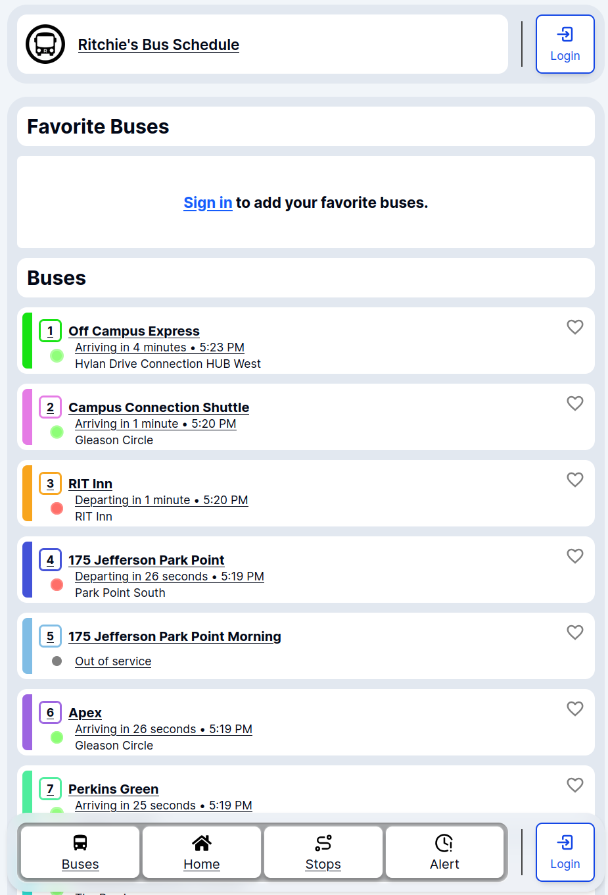
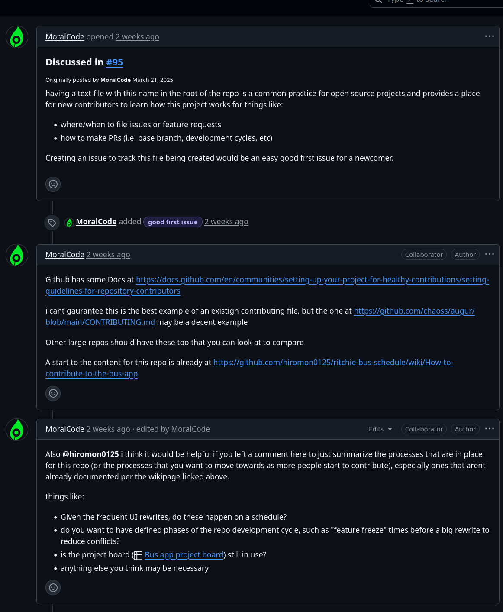
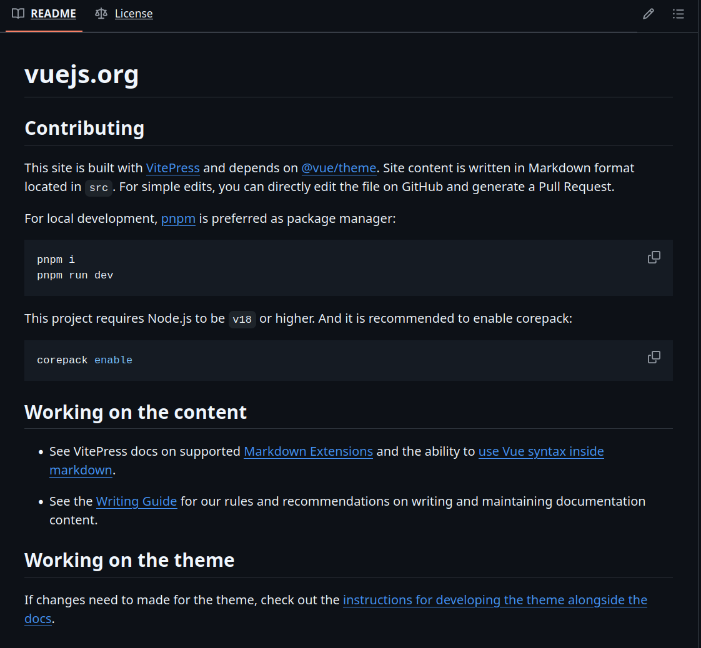

## What is the RIT Bus app?
The RIT Bus app or Ritchie's Bus Schedule, a web application meant to serve as a functional replacement of RIT TransLoc. Transloc was an app RIT used in the past few years to track and display bus schedules and live bus locations. It stopped being supported by RIT in 2023 and according to the [RIT Parking and Transportation website](https://www.rit.edu/parking/) and [RIT's Shuttle Schedule site](https://www.rit.edu/parking/campus-shuttles): 'Passio GO!' is the latest in use. [Ritchie's Bus App](https://www.rit-bus.app/) is meant to step in and fill a user necessity left in the wake of the loss of Transloc. The app is also meant to be more accessible by any device with a web browser, and be more intuitive than what RIT's standards are now. 

## What's unique about RIT Bus App?
The app is live and accurate tracking of busses in progress with real time updates to bus scheduling. It also has inclusion for RIT alerts that a bus or bus route may be down that day. It also lets users create an account that is tracked on login with their favorite busses so that they show up on the top of their home feed. Other apps for RIT don't have this much personalization because of how modular they are meant to be from their parent company that RIT hires to design and finish necessary dedicated apps; so unless included by contracted terms, this creates potential for issues with the actual students that use it and not the separated company hired to write code that could apply to thousands of campuses. The usability and design of the app is what sets it apart:

## Why am I helping + What's the impact? 
I have been involved in RIT's Student Government Sustainability Committee (sadly now deceased) since the spring of my first year at RIT. We worked to solve sustainable issues on campus, communications and outreach to students and clubs about Committee initiatives, and sustainable transportation, which had bus or rideshare options frequently come up in conversation. A lot of students have been frustrated, myself included, with RIT not having not just a reliable bus schedule app, but also having apps and tech that are not cross-platform. The Official RIT app is one of them. It is unavailable on the app store because RIT and the parent company it has haven't updated the program for Android 15 (latest phone update to work with iOS 18). This project for me has a clear and obvious impact on being something that is built with RIT users in mind specifically and accessible to any user, even beyond mobile. I am a New Media Interactive Development major with lots of experience with web applications and all of the build environment that the app is constructed with, so I saw an immediate and relevant space to use my ability to help current students.

## How did I start working on this project and how might've Commarch helped?
My group and I did a presentation on the RIT Bus app and I found it very personally drawing because of my skillset and passion for sustainability and community service projects. I then was able to get in touch with the project lead and founder over the Open Source discord server, as well as communicate with a collaborator on the project, our TA and someone I have known has a similar passion, Adrian. 

## My Focus area (My assignment for help)
I was looking for anyway I could lend an immediate hand, especially for things that might be hard during the development process of the app to take time on the side to do. I informed Adrian, our TA and a collaborator, that I was looking to help out any way I could and for him to leave a notice in the discord or on Github. I got this notice from him a few days later: 
.
 [This was the link mentioned in the messages](https://github.com/hiromon0125/ritchie-bus-schedule/wiki/How-to-contribute-to-the-bus-app) to some existing contribution documentation. My job was to reformat the document a bit and improve or streamline it where it might be needed, and then add it to the "self-repo" or somewhere on the main page. Through all of this work, Vue.js' repository documentation has been my inspiration for good and professional markdown documentation. This is an example of one of their documents for contributions 

## Struggles
I, in honesty, have had a lot of time conflict with my capstone work and some other projects. There hasn't been much struggle with the software, markdown has just more of a very useful learning experience for me since I haven't had much professional use of it. I have also had some struggle trying to make sure it captures everything correctly and appropriately for someone at the starting point of the app contributing process. Also just trying to keep contact with Hiro, the founder, and Adrian, the TA, has been a bit of a challenge with my aforementioned time issues

